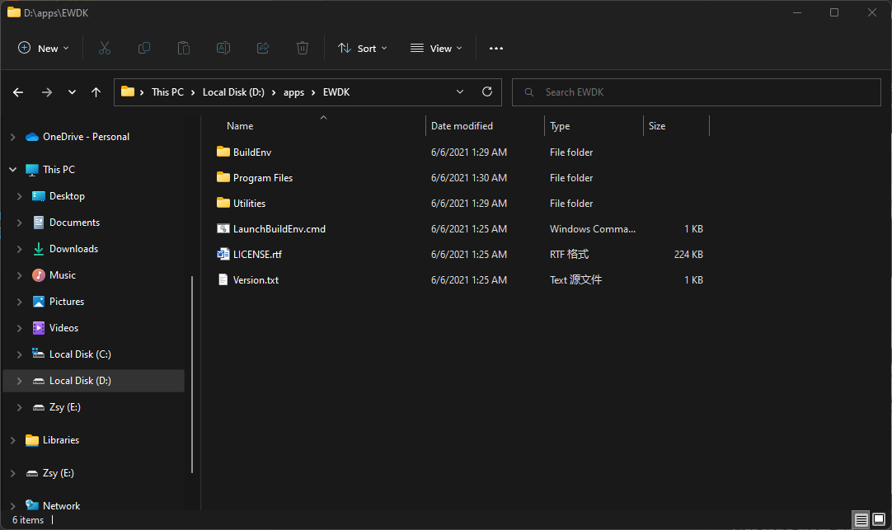
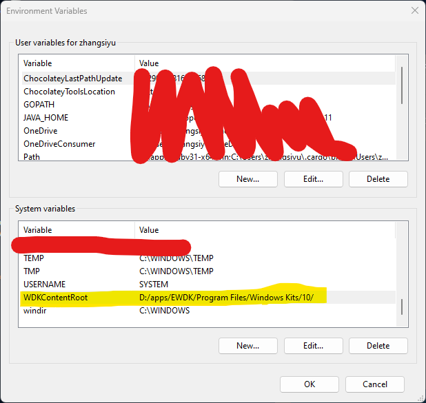
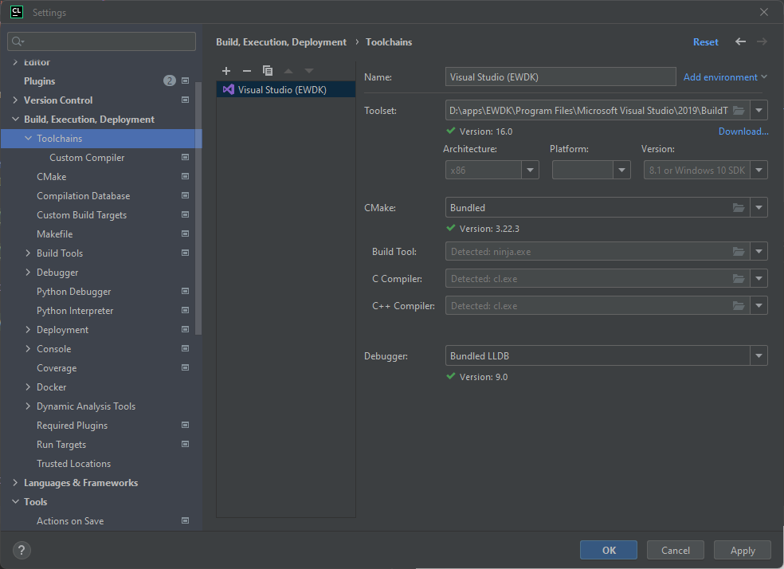
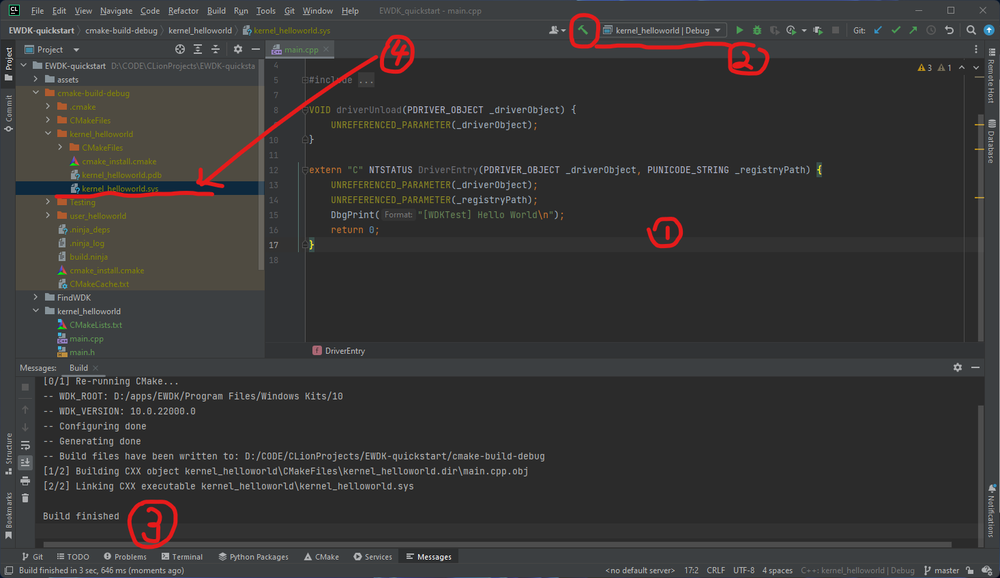

# EWDK Quickstart

An example project for building Windows Kernel Module.

## Environment

* Windows 10+
* CMake 3.22+ and FindWDK (https://github.com/SergiusTheBest/FindWDK)
* Enterprise Windows Driver Kit
* (Optional) C++ IDE that supports cmake project, such as Clion, Visual Studio

## Usage (with Clion)

### Get EDWK

by https://docs.microsoft.com/en-us/windows-hardware/drivers/download-the-wdk#enterprise-wdk-ewdk

### Set Environment Variable

If you have successfully acquired the WDK and put it somewhere.
such as `D:\apps\EWDK\ ` .





### Get repo from git
```shell
git clone --recursive https://git.com/zsy-arch/EWDK_quickstart
cd EWDK_quickstart 
```

### Open with Clion
```shell
clion .
```

### Set up C++ compiler

Go to File > Settings > Build, Execution, Deployment > Toolchains.
Click `+` and add a `Visual Studio` toolchain, then set up the EDWK's Visual Studio path.


### Write code and Build it


